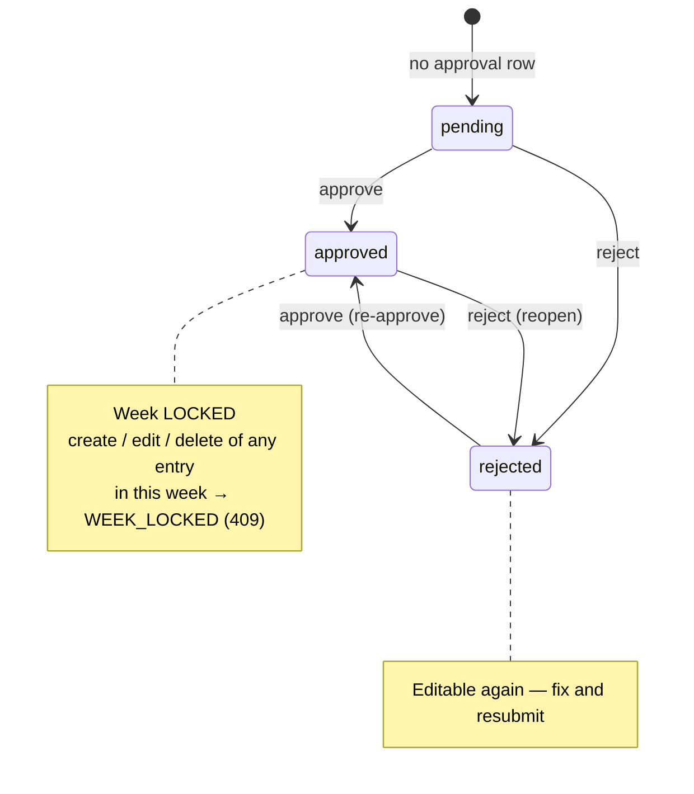
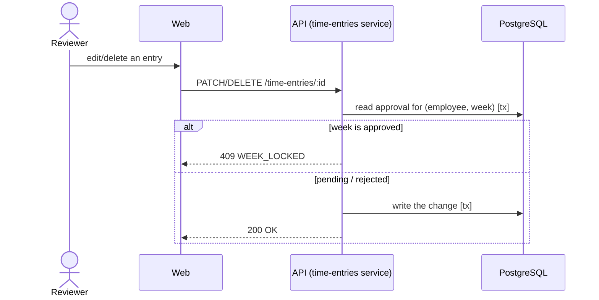

# Approval flow & locking

The per-(employee, week) approval state machine. Only `approved` locks that week's time entries;
`reject` reopens. Absence of a row = implicitly `pending`.

The lock is enforced in the time-entries service, inside a transaction, so the check and the write
are atomic:

See [`specs/features/approval-flow.md`](../../specs/features/approval-flow.md).
