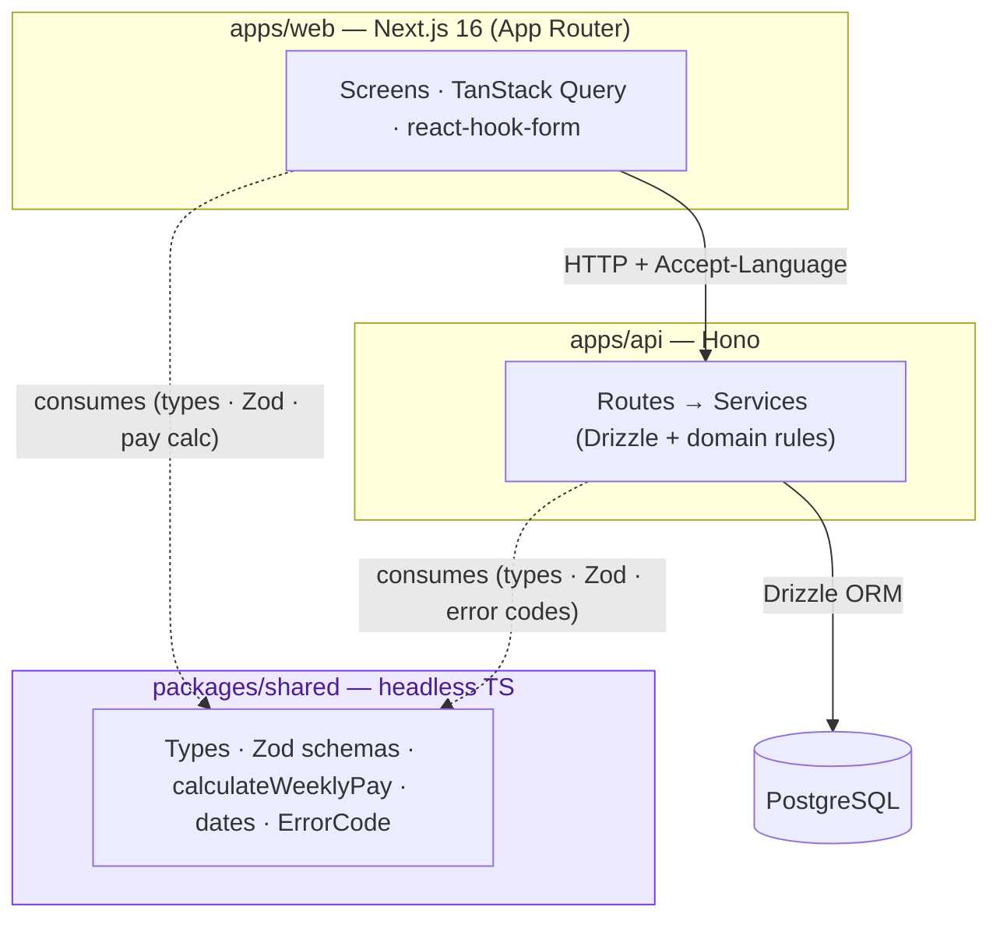

# Architecture

Monorepo dependency + runtime view. `packages/shared` is **headless**: both apps consume it, it
depends on neither — so all arrows point *into* it. The web client computes pay by calling the
shared `calculateWeeklyPay`; the API never computes pay for the weekly summary.

- **Solid arrows** = runtime calls. **Dashed arrows** = build-time dependency on `shared`.
- `shared` has no outgoing arrows — it imports no framework/platform code (no React, `window`,
  `process`). This is the graded "headless + genuinely consumed" rule, made visual.
- Validation uses the **same** shared Zod schemas on both sides; errors flow back as the envelope
  `{ error: { code, message } }`, localized en/es by `Accept-Language`.

See [`specs/overview.md`](../../specs/overview.md) and
[`specs/foundations/`](../../specs/foundations/) for the rationale.
