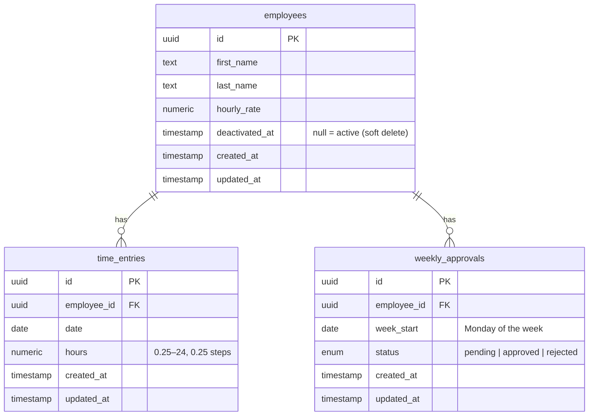

# Data model (ER)

The **database** schema (`apps/api/src/db/schema`). Persistence layer only — computed shapes like
the weekly summary (and the pay breakdown) are derived in
[`specs/features/weekly-summary.md`](../../specs/features/weekly-summary.md), not stored.

- `employees` is **soft-deleted** via `deactivated_at` — rows are never removed, so historical
  `time_entries` and `weekly_approvals` stay intact.
- `time_entries` has an index on `(employee_id, date)`.
- `weekly_approvals` has a **unique** `(employee_id, week_start)` — absence of a row means
  implicitly `pending`.
- Money/hours are `numeric` (never float). Dates are `date` (date-only, no timezone).

See [`specs/foundations/api-platform.md`](../../specs/foundations/api-platform.md) and the feature
specs for the rules behind each table.
