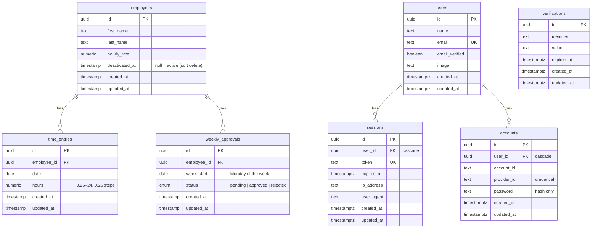

# Data model (ER)

The **database** schema (`apps/api/src/db/schema`). Persistence layer only — computed shapes like
the weekly summary (and the pay breakdown) are derived in
[`openspec/specs/weekly-summary/spec.md`](../../openspec/specs/weekly-summary/spec.md), not stored.

```mermaid
erDiagram
    employees ||--o{ time_entries : "has"
    employees ||--o{ weekly_approvals : "has"
    users ||--o{ sessions : "has"
    users ||--o{ accounts : "has"

    employees {
        uuid id PK
        text first_name
        text last_name
        numeric hourly_rate
        timestamp deactivated_at "null = active (soft delete)"
        timestamp created_at
        timestamp updated_at
    }
    time_entries {
        uuid id PK
        uuid employee_id FK
        date date
        numeric hours "0.25–24, 0.25 steps"
        timestamp created_at
        timestamp updated_at
    }
    weekly_approvals {
        uuid id PK
        uuid employee_id FK
        date week_start "Monday of the week"
        enum status "pending | approved | rejected"
        timestamp created_at
        timestamp updated_at
    }
    users {
        uuid id PK
        text name
        text email UK
        boolean email_verified
        text image
        timestamptz created_at
        timestamptz updated_at
    }
    sessions {
        uuid id PK
        uuid user_id FK "cascade"
        text token UK
        timestamptz expires_at
        text ip_address
        text user_agent
        timestamptz created_at
        timestamptz updated_at
    }
    accounts {
        uuid id PK
        uuid user_id FK "cascade"
        text account_id
        text provider_id "credential"
        text password "hash only"
        timestamptz created_at
        timestamptz updated_at
    }
    verifications {
        uuid id PK
        text identifier
        text value
        timestamptz expires_at
        timestamptz created_at
        timestamptz updated_at
    }
```

- `employees` is **soft-deleted** via `deactivated_at` — rows are never removed, so historical
  `time_entries` and `weekly_approvals` stay intact.
- `time_entries` has an index on `(employee_id, date)`.
- `weekly_approvals` has a **unique** `(employee_id, week_start)` — absence of a row means
  implicitly `pending`.
- `users`, `sessions`, `accounts`, `verifications` are the **Better Auth** tables (see
  [`openspec/specs/authentication`](../../openspec/specs/authentication/spec.md)). They are
  independent of the payroll tables: a user is a person who signs in, not an employee.
- Money/hours are `numeric` (never float). Dates are `date` (date-only, no timezone).

See [`openspec/specs/api-platform/spec.md`](../../openspec/specs/api-platform/spec.md) and the
capability specs for the rules behind each table.
